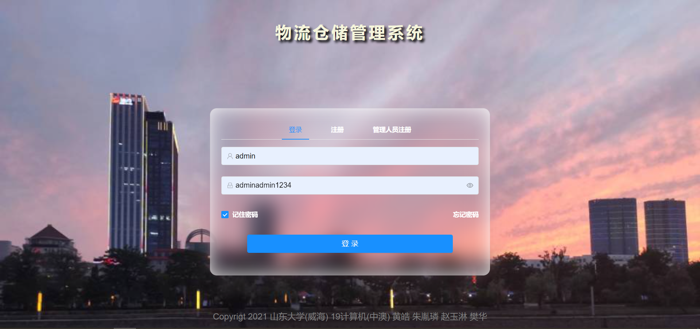
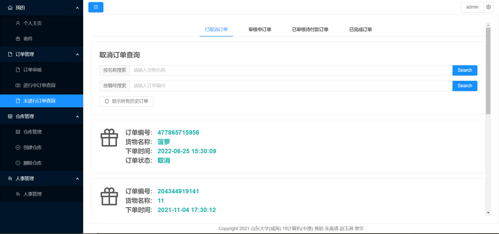
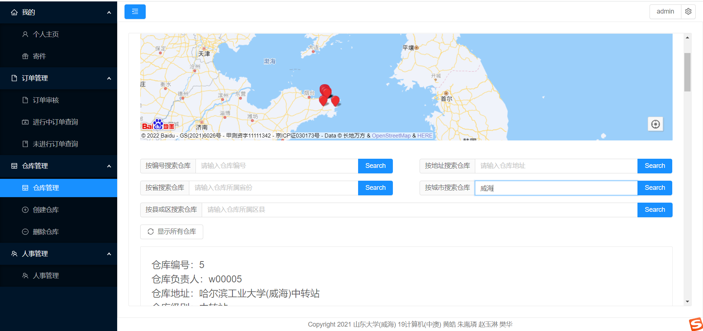
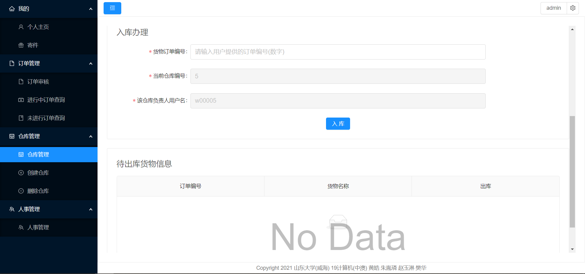

### 1.环境配置与项目运行

1. 安装nodejs环境（参考网上教程），本地当前nodejs版本和捆绑安装的npm版本如下：


2. 下载git仓库。

3. 安装依赖。下载完git仓库后找到该仓库（文件夹名称为sweFrontend）。进入sweFrontend文件夹，调用命令行，输入以下指令。该指令的作用是安装项目依赖的包，项目上传github不会上传包，需要重新安装。

   

4. 运行项目。仍然在当前文件夹目录下输入指令。该指令是使用webpack工具对项目进行编译运行，输入的这些npm命令实际是绑定了对应的webpack的指令，有兴趣可以了解webpack的使用。**（注意：在此只提供针对命令行的项目运行相关指令，简便期间可以自行查找对应IDE的快捷编译运行键的设置）**

   

   

5. 下载另一个git仓库，sweBackend是后端项目

6. sweBackend使用java开发，具体配置参考后端项目的readme文档
7. 确保后端项目正常运行，要保证本项目中Vue.config.js中描述的服务器地址与后端项目运行地址相同

8. 根据第4步的结果打开浏览器，输入对应回环测试网址即可。注意，此时不应关闭命令行，第4步命令行实际是运行了web服务器。**（注意：由于设计时没有考虑性能，在首页加载了大量框架阻塞了渲染，打算后续优化，所以第一次打开时加载速度会比较慢，请耐心等待）**

   


### 2.项目结构说明


1. .idea文件夹：该文件夹是使用jetbrain系列的IDE打开项目时生成的文件夹，与项目开发内容无关。
2. dist文件夹：编译后项目文件夹。如果使用```npm run build```命令，那么就会编译项目，编译后的项目保存在dist文件夹，关于编译后项目的结构，可以暂时不考虑（有兴趣可以了解webpack知识）。或者使用```npm run serve```命令，表示编译运行，也会在dist中生成编译后项目。编译后的项目可以用于服务器部署，或者利用相关软件打包成移动端软件。
3. info文件夹：readme文档用到的图片存储在该文件夹。
4. node_modules文件夹：包管理文件夹。```npm install```下载的依赖都存储在该文件夹，该文件夹也为nodejs的运行提供支持，在上文中“1.环境配置与项目运行的第5点”中提到的web服务器就是由nodejs实现的。简单来说，该文件夹为JavaScript的运行提供了支持，并存储了JavaScript相关的包，为框架提供支持。
5. public文件夹：静态文件文件夹。在项目开发时的webpack和Vue版本下，要求了public文件夹存储静态文件，比如照片，视频之类的，打包时直接放入dist文件夹的指定目录中。当然在其他项目下可能没用public，而是static文件夹，意思都是一样的。

6. src文件夹：项目主文件夹。编写的项目内容都在该文件夹中。

7. .gitignore文件：描述性文件。描述项目git上传时应该忽略什么信息，例如忽略各种依赖包，避免项目过大。开发时一般不考虑该文件。

8. babel.config.js文件：设置性文件。设置babel编译器的信息。babel是一个编译器，在本项目中用于将ES6标准下的JavaScript编译，生成ES5标准下的JavaScript编译后的中间代码。避免高版本有些浏览器无法正常运行。**实际上这些配置使用Vue-Cli工具在项目搭建时就已经自动配置好了，并不用关心。**不过应该提一下，“编译原理大作业：静态作用域语言的变量检查”。如果语言选择JavaScript，那么JavaScript变量是无法类型检查的，可以下载Facebook提供的Flow.js扩展JavaScript的文法，对JavaScript类型检查。但是扩展文法的JavaScript无法再浏览器端正常运行，这时就可以使用babel编译扩展文法的JavaScript，生成原始文法的JavaScript的中间代码。总的来说，babel编译器可以把JavaScript编译成你希望的形式。

9. package.json文件：描述性文件。package.json与node_modules文件夹相辅相成，描述了项目应该安装哪些依赖包。当输入```npm install```后就回去该文件中查询，应该安装哪些依赖包。这是它的主要作用，当然它还可以设置一些npm 指令映射。其它功能有兴趣再了解。

10. package-lock.json文件：描述性文件。该文件描述了项目实际安装了哪些依赖包，在package.json文件中要求的包被安装后都会记录到该文件中。

11. vue.config.js文件：设置性文件。可以用于设置webpack相关设置，本项目主要用它设置应用服务器的地址。下面指明了应用服务器（后端）的地址，在项目中发送http请求时用/api就可以代指该地址。

    ```javascript
     devServer: {
            proxy: {
                '/api': {
                    // 服务器
                    target: 'http://localhost:8081',
                    ws: false,
                    changeOrigin: true
                }
            }
        },
    ```

    该文件中的其它配置是涉及到项目编译时的设置（移动端适配），用到时再了解即可。


### 3.项目使用说明

#### 3.1 登录界面

使用管理员账户登录，账户密码如下：（记住密码表示密码本地存储，下次登录时会直接跳转到个人主页）



注册普通用户，普通用户可以进行寄快递，查询快递进度**（注意：如果发送验证码收不到，可能是发邮件接口过期了，直接用管理员登录即可，管理员也具有该功能）**：


管理人员注册（公司认证码：管理员：all，人事管理员：people，财务管理员：financial，订单管理员：order，调度管理员：assign，仓库管理员：warehouse，运输员：trans）：


忘记密码（**注意：邮件接口如果过期，则不能使用该功能**）：


#### 3.2 个人主页

#### 3.2.1 导航栏及个人信息修改说明

注意顶部导航栏的蓝色按钮，表示缩小左侧导航栏，而不是返回上一级。在个人主页中可以修改个人信息。导航栏右侧的设置按钮可以退出登录到登录界面，其中的清除缓存选项表示如果用户在登录界面选择了保存密码，那么此时清除本地存储的用户密码，用户下次登录需要重新输入密码，并且不会自动跳转到该界面。


#### 3.3.1 用户收寄件信息说明

用户在个人主页可以修改收件人地址，寄件人地址。


下面用收件人举例，点击添加按钮。然后在该页面编辑信息。在选择地址中填写地址，该地址支持模糊搜索，搜索完毕后会在地图上显示。


### 3.3 寄件

#### 3.3.1 寄件首页

寄件页面如下，需要填写收件人，寄件人信息，物品信息


#### 3.3.2 收寄件人信息填写

下面用寄件人举例，点击寄件人信息


当然，如果在个人主页已经填写了常用收件人，寄件人信息的话，在此可以使用自动填写


点击自动填写按钮，此时可以选择个人主页已经填写过的寄件人信息


#### 3.3.3 完成填写

按照上述步骤填写完收寄件人信息后填写货物信息，缺少填写则无法提交


### 3.4.订单管理

#### 3.4.1 订单审核

订单审核界面只有全局管理员和订单管理员才能看到。下拉货物列表，找到刚刚填写的订单并审核。


找到刚刚下的订单，然后点击进入审核界面


填写审核信息，这里点击审核不通过 **（原因是，本项目设立的快递仓库不足）**


#### 3.4.2  进行中订单查询

该界面用户可以查询到。进行中订单指的是用户下单后通过审核且付款后才能算是订单进行中。**本界面接口设计出现问题，暂时还没有修复，查询数据库速度很慢，出现下面情况不代表没有进行中订单，请点击“加载更多”，或“显示所有订单”按钮，等待一段时间**


等待一段时间后出现下列结果。请寄件表示用户已付款但是还没有投放到快递站，此时可以取消订单。可以随机点击一个订单查看运输进度详细信息。


我们点击“手机”，查看订单运输的详细信息。可以看到系统为其规划的路线信息，其中对号表示已经到达了其中某个仓库，下面有具体的进入仓库的时间。**未进入的仓库不会显示时间（下面可能有bug，显示了未进入仓库的时间，以前没有遇到过，下次修改）**


可以缩放百度地图，查看系统为其规划的路线。可以看到这是一个市内的调度，表示从哈工大寄件到山大，系统规划路线为：“哈工大快递驿站”到“仙姑顶中转仓库”再到“山大驿站”。


#### 3.4.3 未进行订单查询

未进行订单可以显示我们下单的历史记录，在已取消订单中可以看到我们刚刚审核失败的订单“菠萝”。当然可以点击它查看详细信息，这里就不再演示了。



点击已审核待付款订单，用户可以在这里找到自己已经通过审核的订单，点击它付款


点击该订单进行付款，由于支付宝接口申请复杂，所以在此直接用二维码付款。付款全凭自觉，当然你也可以假装付款了。


已完成订单选项可以查询历史已完成订单，也可以查看详细信息，这里就不做演示了。


### 3.5 仓库管理

#### 3.5.1 仓库管理

仓库管理界面只有全局管理员和仓库管理员可以看到


缩放百度地图可以查看所有建立的仓库，目前在云南省，河南省，山东省设有仓库。在该界面还设置了一个隐藏按键，在不输入任何值的情况下点击“按省搜索仓库”，可以自动缩放地图，查看所有仓库。


我们还可以查看仓库的详细信息，比如我们搜索威海市仓库，选择第一个仓库查看信息，点击该仓库查看具体信息



点击后进入仓库详情页面，仓库基本信息较多所以进行了折叠，可以点击右上角按钮进行展开。货架信息表示了仓库中货架的详细信息，只有设置了货架信息的仓库才能参与物流调度，点击“查看”按钮可以继续查看货架信息


点击“查看”按钮，结果如下。如果该仓库的该货架存储有货物，那么详细信息会显示在该页面


点击返回，退回到“仓库详细信息界面”，下拉进度条。此部分是入库，出库办理模块。 **仓库管理员可以在收件时先填写货物的订单编号，这样系统会自动为货物安排货架位置。待出库货物信息将会按照指定算法计算权值，按照权值排序，决定出库顺序。**



#### 3.5.2 创建仓库

创建仓库页面只有仓库管理员和全局管理员可以访问。 **在这里要注意一个问题，仓库级别有3级。1级表示面向用户的驿站，用户来这里投放快递，或者取走快递。2级表示市级中转仓库，1级仓库的快递会运输到2级仓库，如果是发往同城的快递，那么在2级仓库会直接调度，发往离收件人最近的1级仓库。如果是不同城的快递，那么会发往3级仓库。3级仓库表示省级中转仓库，负责调度跨省或者省内跨市的快递运输。所以说，如果想让某地能够首发快递，至少要建立3个不同级别的仓库。** 仓库位置的选择与收寄件人的地址填写不同，这个需要手动填写，因为考虑到有些仓库建立的地方是没有名称的，无法搜索的，因此需要手动在地图上点击，选择位置。


#### 3.5.3 删除仓库

删除仓库是危险的。因为仓库无法通过脚本批量产生（本项目已经用脚本产生了大量虚拟用户与各类管理员），需要根据具体情况人工选择。因此在这里禁用了删除按钮。


### 3.6 人事管理

人事管理页面只能由人事管理员或全局管理员访问


可以选择修改信息


### 3.7 完整收寄件流程演示

#### 3.7.1 用户填写收寄件信息

寄件人选择哈工大的吴亦凡。 **（不要选其它的，有些地方仓库没有建全）**


收件人选择最后一个樊华，第一个也可以。 **（选择其它地区不保证邮寄成功，仓库创建不全）**


随便填写物品信息，之后点击提交


#### 3.7.2 管理员审核订单

订单审核界面找到刚刚下的订单，点击进入审核界面，点击审核通过


#### 3.7.3 用户找到审核通过的顶单并付款


#### 3.7.4 用户查询进行中的订单

一直点击加载更多，在最下方找到进行中的订单。 **（此过程比较慢，是接口问题，请耐心等待）**。找到订单后，记录下订单号，因为一会用户要去驿站寄快递，需要提供订单号。在此记录下订单号142169186046。


#### 3.7.5 用户寄件，仓库管理员入库

用户去最近的驿站寄件。因为我们选择的是哈工大的寄件地址，所以我们去举例最近的1级仓库—哈工大驿站去寄件。 **此处应该是哈工大驿站的仓库管理员操作，但因为账户密码都忘了，所以用管理员操作，管理员可见所有仓库，所以要先找到哈工大驿站** 。选择第二个，要注意，我们要在驿站中入库，不能去中转站入库，因为中转站是2级仓库，不是面向用户的。


此时用户到达驿站，将货物交给工作人员，工作人员（仓库管理员）将订单编号填入系统，完成入库。（点击一次入库即可）


入库完成后可以进行检查，点击A货架的“查看”按钮，查看货物信息。由下图可知，货物已经成功进入驿站。此时用户离开驿站，驿站等待运输员运输货物。


#### 3.7.6 运输员取走货物

找到进行中订单查询页面，由于该接口比较慢，我们直接使用搜索功能，搜索订单名称


点击订单，查看详细信息。在此可以看到快递调度的详细信息。我们知道了接下来要运送到哪些仓库。现在我们要做的就是模拟运输过程，**（运输员的账户和密码都忘记了，只能用管理员来模拟）** 下一步就是将货物运往仙姑顶，并进行入库。


接下来省略掉运输时间，运输员取走哈工大驿站的货物，所以先进行出库。之后运输员携带货物到达2级仓库—仙姑顶仓库时，会进行入库操作。

下面还是先找到刚刚的哈工大驿站，此时仓库管理员出库该货物，因为此时运输员来取走货物了。


#### 3.7.7 运输员到达仙姑顶2级仓库

先找到仙姑顶仓库 **（此步骤本应由仙姑顶仓库管理员完成，但是方便起见，用全局管理员完成）**


办理入库操作


过了若干时间以后，另一个运输员来到仙姑顶仓库，他要取走该货物，运输到3级仓库—哈尔滨工业大学中转站。此时仓库管理员为他办理出库业务。（在待出库货物信息中点击出库即可）


#### 3.7.8 运输员到达3级仓库哈尔滨工业大学中转站

运输员将货物带到3级仓库等待跨省运输，此时仓库管理员为其办理入库操作


经过若干时间后，另一运输员前来取件，将快递按照约定路线运输到河南的3级仓库高寨中转站，此时仓库管理员为其办理出库业务


#### 3.7.9 运输员到达3级仓库高寨中转站

重复上述操作即可， **先找到该中转站，模拟该仓库管理员的操作，进行入库。若干时间后运输员来取件，模拟仓库管理员的出库操作。**

#### 3.7.10 运输员到达2级仓库黄河路存储仓库

重复上述操作

#### 3.7.11 运输员到达1级仓库黄科接收站

先重复上述操作，先入库。

入库后，收件人会受到短信，通知收件人前来取件。


若干时间后用户前来取件，仓库管理员为其办理“完成订单”服务。


#### 3.7.12 用户查询已完成订单


