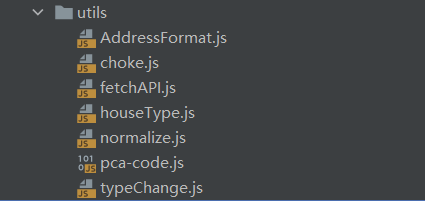
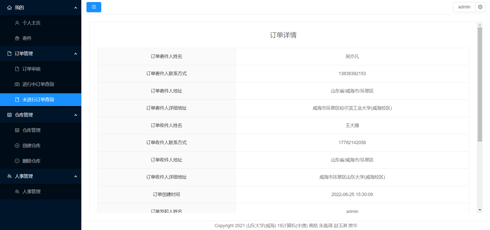
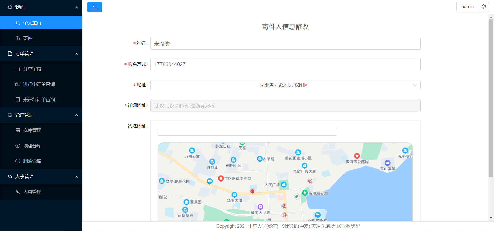
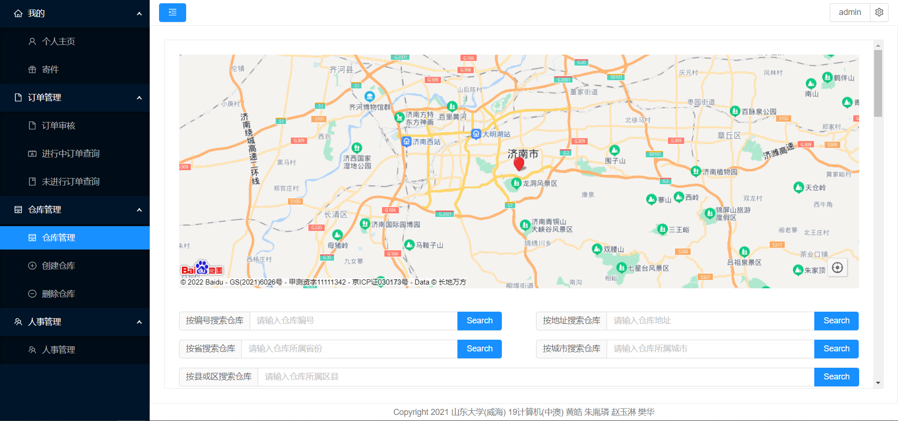

# 1.路由设置

路由设置主要位于src/router文件夹下，路由负责页面之间的逻辑关系。如果要添加页面，那么必须修改路由设置。

### 1.1 index.js

**作用描述：**

index.js负责导出路由信息，导出router对象。然后在src下的main.js入口模块中接收router对象，挂载到根Vue对象中。在index.js中一般不需要做修改，在项目开发时可以使用Vue-Cli工具自动生成该文件，也可以在Vue官网上根据Vue路由给出的规范来写该文件。

**修改意见：**

不需要修改。但如果涉及到打包成移动端APP，需要修改路径，注释中已经给出意见。

**需要学习的知识：**

ES6标准下JavaScript的模块规范，即import和export的使用

### 1.2 config.js

**作用描述：**

本文件定义了页面间的逻辑关系。（1）理解constantRoutes对象，该对象描述了“不变路由”，从代码中的对象描述就可以看出，描述的是登录界面。“不变”的原因是不论什么权限的用户，都会访问登录页面。（2）理解asyncRoutes对象，该对象描述了“异步路由”，看起有些奇怪，因为constantRoutes在本文件中导出，在index.js中接收，而该对象根本没有使用。这个对象实际上是在用户登录时检查用户权限时被添加到总路由对象中的。简单来说就是，用户点击登录，然后脚本检查用户权限，根据权限，将“异步路由”对象选择性地和“不变路由”进行合并。（3）理解实现原因。这种做法就是企业中常用的权限管理的解决方案（参考了阿里巴巴的项目）。当页面数量庞大时，往往难以用if或switch把页面和权限关联起来，决定展现给用户哪些页面，因此我们采用该方法。（理解至此即可，不必深究）

**修改意见：**

不需要搞懂每一个语句的作用，如果需要添加页面，那么模仿着asyncRoutes对象的写法，在其中添加即可。如果有必要可以去Vue官网查找路由相关api查看对象属性的含义。

**需要学习的知识：**

箭头函数的用法

### 1.3 Permission.js

permission.js位于src目录下，也是和页面逻辑相关的文件

**作用描述：**

permission.js是路由守卫文件，描述了浏览器每到达或离开一个页面时，脚本需要完成的动作。使用Vuex存储临时文件在刷新时会导致数据丢失，可以用该文件解决；防止用户越权限访问页面，可以用该文件解决。还有诸多功能可以实现。该文件逻辑比较复杂，不建议阅读，前期已经完善好了，不需要修改。

**修改意见：**

不建议修改，不建议阅读，了解作用即可。

# 2.组件通信

每一个页面都对应一个Vue对象（也可以说是组件），这些对象间需要通信，这里描述项目中使用Vuex进行对象通信的方法（就是页面间传递消息）。组件通信设置位于src/store文件夹下。

### 2.1 index.js

**作用描述：**

这里的index.js类似于路由设置中的index.js。都是引入其它文件的内容，然后将它导出，交给入口脚本main.js处理。

**修改意见：**

未来很长时间这里应该不需要修改。如果需要修改，例如多个组件间需要传递新的信息，那么新建一个描述该信息的脚本文件存储到/src/store/modules中，再加入到本文件的modules中。

**需要学习的知识：**

Vuex，查询Vue官网了解Vuex。如果不需要组件通信，则不需要了解。

### 2.2 /modules/user.js

**作用描述：**

这里的user.js描述了登录页面的组件与登录后页面的组件的通信接口。相关函数执行时会进行权限判断，实现上文提到的“异步路由”。实现模仿了阿里巴巴的Antd-Pro项目框架。

**修改意见：**

不建议修改或阅读。理解作用即可。理解此文件需要花费比较多的时间，需要有扎实的Vuex基础。

### 2.3 /modules/permission.js

**作用描述：**

这里的permission.js也是提供负责权限管理的接口，实现上模仿了Antd-Pro框架。简单理解，就是封装了一些函数供user.js使用，把上文提到的“异步路由”中符合用户权限的部分和“不变路由”合并。

**修改意见：**

不建议修改，这是比较底层的部分，常规维护不涉及，也没有必要去阅读。

# 3.Http通信接口

通信接口进行了封装，封装到了一个文件

### 3.1 /src/utils/FetchAPI.js

**作用描述：**

FetchAPI封装了fetch函数，fetch函数是ES6标准下的http通信函数，负责收发http请求。该函数是ES6标准以后客户端JavaScript进行网络通信的主流。该文件导出了fetchAPI对象，在各个组件中，如果想要收发网络请求，直接引用该对象即可，具体发送格式，可以随便找一个页面组件进行参考。

**修改意见：**

不建议修改。如果需要打包成移动端APP，需要修改，修改意见已经在该文件中给出注释。

**需要学习的知识：**

fetch的用法

### 3.2 vue.config.js

**作用描述：**

该文件位于项目根目录下，不在src目录中。该文件已经在readme中提到，主要是配置打包信息。本项目在该文件中设置了“/api”来代指后端服务器的地址，如果后端服务器地址发生改变，则需要修改本文件。具体修改意见已经以注释形式给出。

# 4.src下项目结构说明

### 4.1 目录结果说明

1. assets文件夹：用于存储媒体资源，例如图片，视频。本项目基本不用该文件夹。
2. router文件夹：用于路由设置，上文已经提到
3. store文件夹：用于组件通信，上文已经提到
4. utils文件夹：提供工具类，简单来说，就是封装函数给其它组件使用，下文具体介绍
5. views文件夹：描述页面信息，下文具体介绍
6. App.vue文件：Vue根组件，后期维护不需要阅读与修改

7. main.js文件：项目入口脚本，负责引入与注册必要的组件，比如路由对象，Vuex对象等等，后期维护一般不需要阅读与修改
8. permission.js文件：路由守卫文件，在路由设置中已经提到

### 4.2 utils文件夹说明

1. AddressFormat.js文件：把地址规范化。有些页面会填写地址，例如“收寄件信息填写”，此函数会把地址规范化，转化成前后端约定的形式。简单来说，就是接收到用户填写信息后，用此函数进行处理，之后发送给后端服务器。
2. choke.js文件：节流防抖函数。防止点击过快，短时间提交多次请求给后端服务器以及避免过快点击导致的页面性能下降。某些页面涉及点击按钮，可以引入该函数。有兴趣可以了解，需要提前学习闭包的知识（就是编译原理中提过的静态作用域规则）。

2. fetchAPI.js文件：封装网络请求函数。上文已经提到。
3. houseType.js文件：提供一个Map映射，描述3级仓库对应的中文。这个设计不太好，当时编写项目时不知道JavaScript自带Map函数。不过后期维护时，该文件没必要修改，没必要阅读。
4. normalize.js文件：提供了一个函数，负责把全国省市信息处理成指定格式，使得该格式满足Antd框架下的要求。简单来说就是，在“收寄件填写省市信息”时，会有选择框选择全国省市信息，我们必须要下载省市信息，并且按照指定格式传递给选择框，该文件就提供了此功能。

5. pca-code.js文件：全国省市信息的JSON对象描述形式。
6. typeChange.js文件：提供了一个映射，把各种权限用户的中文与英文缩写一一映射。

### 4.3 views文件夹说明

1. Assign文件夹：调度模块页面文件夹（还未实现好）
2. Login文件夹：登录模块页面文件夹
3. Order文件夹：订单管理模块页面文件夹
4. Page文件夹：整体页面框架文件夹（提供一个容器）

5. People文件夹：人事管理模块页面文件夹
6. Trans文件夹：运输管理模块页面文件夹（还未实现好）
7. User文件夹：用户界面模块页面文件夹

8. value文件夹：财务管理模块页面文件夹（还未实现好）

9. WareHouse文件夹：仓库管理模块页面文件夹

#### 4.3.1 Login文件夹说明

1. Forget.Vue文件：忘记密码页面
2. Login.Vue文件：登录注册页面

#### 4.3.2 Order文件夹说明

1. Order.Vue文件：订单审核页面

2. Check.Vue文件：订单审核页面点击某个订单后的审核详情页面。

   

3. Ask.Vue文件：进行中订单查询页面

4. Process.Vue文件：在进行中订单查询页面，点击某个订单后展现的详情页面

   

5. NowOrder.Vue文件：未进行中订单查询页面

6. OrderDetail.Vue文件：在未进行中订单查询页面，点击一个订单跳转出来的详情页面

   

7. PayOrder.Vue文件：在未进行中订单查询页面，查询未付款订单，点击订单后跳转到的收款页面

   

#### 4.3.3 Page文件夹

1. Page.Vue文件：提供了页面的框架，描述了左侧导航栏，实现了顶部导航栏，实现了底部版权栏，描述了右部内容栏
2. PageView.Vue文件：实现了右部内容栏，使得右部内容栏可以嵌入页面
3. Smenu.Vue文件：实现了左侧导航栏，递归地从路由列表中选择可显示的页面，放入多级折叠页面导航框中。

#### 4.3.4 People文件夹

1. People.Vue文件：人事管理模块页面

2. ChangeInfo.Vue文件：弹窗文件，在人事管理中如果修改某人信息，会弹窗修改，该文件描述了弹窗信息。弹窗的实现是将该文件导出到People.Vue中，People控制该组件是否显示，如果点击了指定按钮则显示该组件。

   

#### 4.3.5 User文件夹

1. User.Vue文件：用户个人页面

2. EditWarehouseInfo.Vue文件：编辑运输员信息页面。如果是运输员登录系统，则会根据权限展示该页面

3. ChangeUserPassword.Vue文件：修改用户密码弹窗页面（弹窗如何实现参考People文件夹下的说明）

   

4. ChangeUserInfo.Vue文件：修改用户个人信息弹窗页面

   

5. ChangeUserEmail.Vue文件：修改用户邮箱弹窗页面

   

6. ChangeSendInfo.Vue文件：修改收寄件人信息页面

   

7. AddSendInfo.Vue文件：添加收寄件人信息页面

8. AcceptInfo.Vue文件：寄件模块下的收件人信息填写页面

   

9. AutoAcceptInfo.Vue文件：收件人信息填写页面的自动填写弹窗界面

   

10. MailInfo.Vue文件：寄件模块下的寄件人信息填写页面

11. AutoMailInfo.Vue文件：寄件模块下的寄件人信息自动填写页面

12. Send.Vue文件：寄件页面

    

#### 4.3.6 WareHouse文件夹

1. WareHouse.Vue文件：仓库管理页面

   

2. DeleteWareHouse.Vue文件：删除仓库页面

3. CreateWareHouse.Vue文件：创建仓库页面

4. WareHouseDetail.Vue文件：仓库详情页面，在WareHouse.Vue下点击某个仓库会进入到WareHouseDetail页面

   

5. AddShelf.Vue文件：添加货架弹窗界面

   

6. EditShelf.Vue文件：编辑货架弹窗页面

   

7. Shelf.Vue文件：查看货架详情页面。在当前页面下，点击货架右端的“查看”按钮即可跳转到此页面。

   